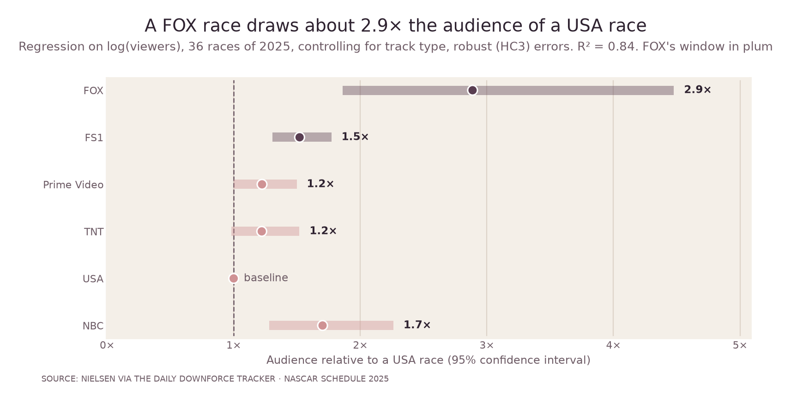
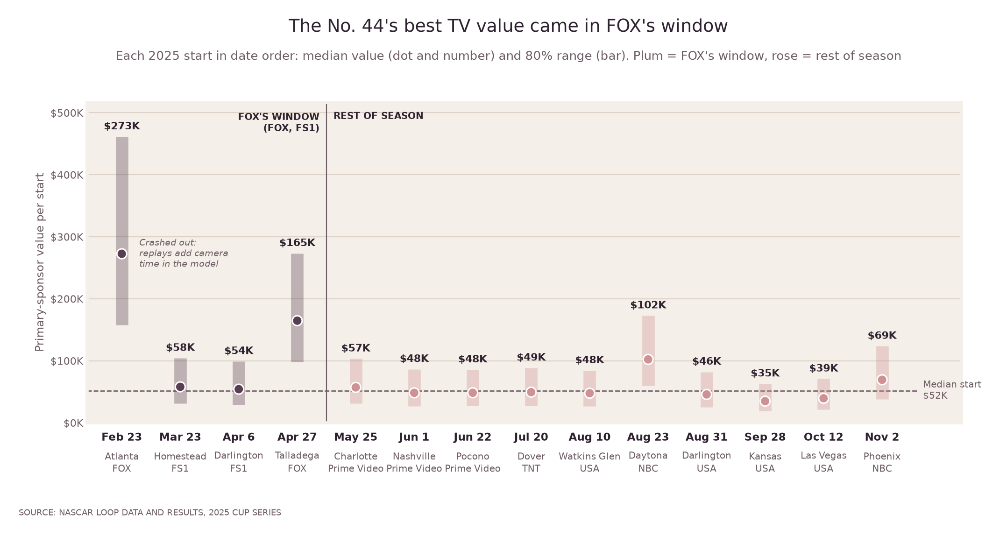
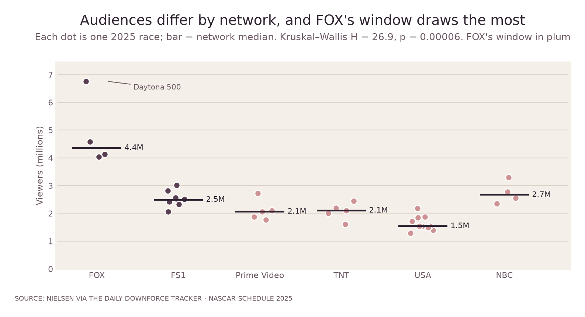
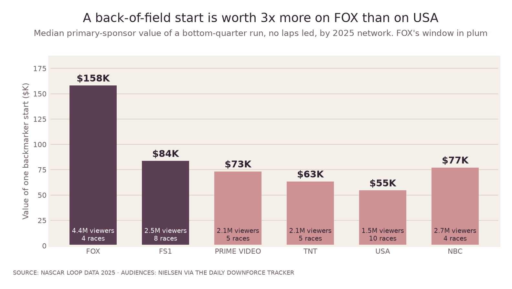
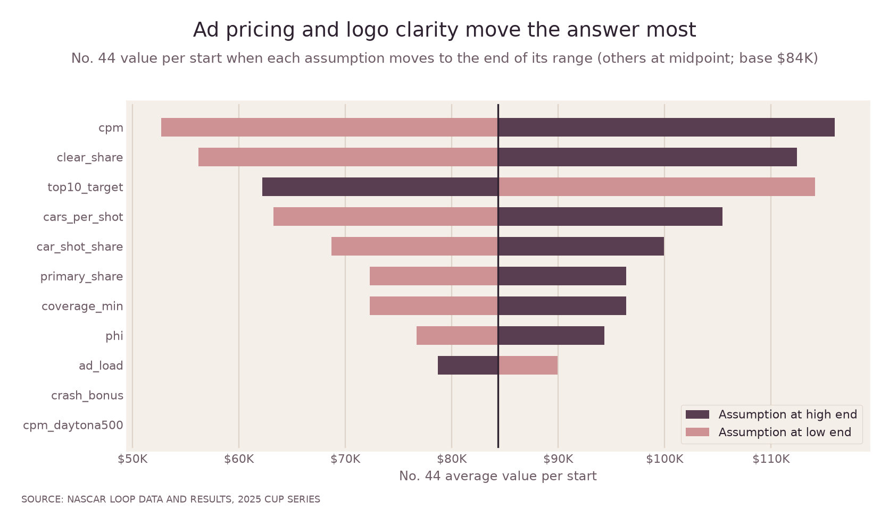

# What is one race on the No. 44 worth?

> I built a model that tells a small NASCAR team what each race is worth to a sponsor on TV, including the risk that the car doesn't qualify, so the team can price races fairly and close more deals.

## The problem

NY Racing is a small, part-time NASCAR Cup team. It funds each race by selling sponsorship on its No. 44 car one race at a time, but it has no good way to show **what one race is worth to a sponsor**, so it can't set a fair price or defend one. Two things make that hard:

1. **The car gets little TV time.** The No. 44 runs near the back of the field, and broadcast cameras mostly follow the leaders.
2. **The car might not make the race.** NY Racing doesn't own one of NASCAR's 36 charters (guaranteed starting spots), so the No. 44 is an *open car* competing for the 4 leftover spots. At crowded races it can be sent home, and its sponsor gets almost nothing.

## What this project does

- **Estimates the TV value of every 2025 start** from NASCAR's race data and Nielsen audiences for all 36 races.
- **Finds what drives that value:** mainly the network and its audience, not the finishing position. A FOX broadcast race draws about 2.9× the audience of a USA race, tested with regression on real data.
- **Prices in qualification risk:** at the 2025 Daytona 500, open cars made the field about half the time, and the No. 44 missed.

## What NY Racing should do

1. **Price races differently**, higher in FOX's window early in the season.
2. **Sell the Daytona 500 with a make-good**: a base fee plus a bonus if the car races, or a credit toward a later race if it misses.
3. **Check the entry list before quoting.** Qualification risk only exists when more than 4 open cars enter.

**Start here:** the four notebooks walk through the whole project with every chart inline.

| Notebook | What it covers |
|---|---|
| [01 · Data collection and quality](notebooks/01_data_collection_and_quality.ipynb) | Sources, the DuckDB warehouse, feed quirks, quality checks, audiences, qualification risk |
| [02 · Exploratory analysis](notebooks/02_exploratory_analysis.ipynb) | The No. 44's season, running position vs. the field, how concentrated laps led are |
| [03 · Exposure model](notebooks/03_exposure_model.ipynb) | Model equations, calibration, Monte Carlo inputs, convergence, qualification posterior, sensitivity, robustness, benchmark and consistency checks |
| [04 · Findings and pricing](notebooks/04_findings_and_pricing.ipynb) | The findings, the network regression, a pricing guide and recommendations |

**Live calculator:** `app/index.html`, a single self-contained page (also published as a shareable Artifact).



## Findings

1. **Where the race is broadcast matters more than where the car finishes.** A back-of-field start on the FOX broadcast network was worth about **$158K** in primary-sponsor exposure (80% range $94K–$263K). The same run on USA was worth about **$55K**. The first 12 races, FOX's window on FOX and FS1, hold **~50%** of a backmarker's season value in 33% of the races.
2. **The most valuable race is the one a part-time team can miss.** A backmarker in the Daytona 500 is worth about **$361K**, over twice any other race. It is also one of only two 2025 races where open cars were sent home. Open cars made the field about half the time (4 of the 8 competing for spots), and the No. 44 was one of those sent home, so the expected value for an open car is about **$180K**. At every race with four or fewer open entries, every open car raced.
3. **Camera time is steeply concentrated.** The car that led the most laps got a median **~470 clear logo seconds** per race against **~36** for a typical backmarker, about **13×**. The top 10 cars capture **~40%** of all sponsor value.
4. **The No. 44's 2025 season:** 15 entries, 14 starts, a median average running position of **34.6**, and 26 laps in the top 15 all year. The model puts its primary-sponsor broadcast value at **$1.1M** for the season (80% range $0.64M–$1.87M), about **$79K per start**.



### The network effect, tested on real data

The pricing finding depends on one real, measured input: audience size by network. It holds up under standard tests on the 36 races' Nielsen audiences, with no model assumptions involved.

- **Kruskal–Wallis test:** audiences differ by network (H = 26.9, p = 0.00006).
- **OLS regression** on log(viewers), network plus track type as controls, robust (HC3) standard errors: a FOX broadcast race draws **2.9× the audience of a USA race** (95% CI 1.9–4.5×), R² = 0.84. Dropping the Daytona 500 still gives 2.6×.
- **Network vs. time of year:** networks air in fixed parts of the season, so network and calendar can't be fully separated. But NBC and USA share the same fall stretch, and NBC's over-the-air races still drew 1.7× USA's audience, so broadcast reach matters beyond timing.



Applied through the exposure model, the same pattern shows up in sponsor value for every back-of-field car (258 starts):



**What this means for pricing.** Price the No. 44 by broadcast window, not flat. Sell the FOX window first. Quote the Daytona 500 with a written make-good (a credit toward a later FOX-window race if the car misses the show). Any price above broadcast value has to be justified by what broadcast data cannot measure: hospitality, content, business-to-business introductions and the team's story. See [docs/value_sheet.md](docs/value_sheet.md).

**What this means for a broadcaster.** See [docs/fox_memo.md](docs/fox_memo.md).

## How the model works

| Step | What happens | Grounded in |
|---|---|---|
| Race data | Loop data (average running position, laps led, top-15 laps) and results for all 36 points races: 1,369 starts, 1,375 entries | NASCAR's public data feeds |
| Who is on screen | Coverage split across the field: a share follows the leader by laps led, the rest decays with average running position. Decay solved per draw so the top 10 take ~50% of coverage | Relo Metrics (top 10 ≈ half of coverage); Rotthoff, Depken & Groothuis, *Applied Economics* 2014 (laps led drives time on camera) |
| Seconds | Coverage minutes × (1 − commercial load) × car shots × cars per shot × logo clarity | Assumptions with ranges, listed in `src/model.py` |
| Dollars | Clear seconds ÷ 30 × (CPM × audience) × primary sponsor's share of the car | 2025 Nielsen audiences per race; 2025 Daytona 500 FOX spot prices ($400K–$500K+) for the CPM anchor |
| Qualification | Open entries vs. the 4 open spots, per race; Beta posterior for oversubscribed races | 2025 entry lists (36 charters inferred from the 36 cars that entered every race) |
| Uncertainty | 2,000 Monte Carlo draws over every assumption; one-at-a-time sensitivity | `src/analysis.py` |

**Sanity check against published data.** Rotthoff et al. report a mean of $38.6M in exposure value per driver-season for 2001–2007 (Joyce Julius data, all logos plus verbal mentions, audiences around three times today's). This model gives about $9M per full-time car for 2025, counting only clear primary-sponsor logo time. Scaling for audience and scope puts the two in the same range.

**What moves the answer.** CPM and logo clarity dominate: each swings the No. 44's per-start value between about $55K and $115K. The ranking of races and the concentration findings hold across the full range, because audience size and running position drive them, not the scale assumptions. The crash-coverage assumption barely moves the season total but moves value between races (it roughly doubles the Atlanta crash race), which is why it is the first thing the validation sample tests.



## Limitations

- **This is media value, not ROI.** Sponsor return depends on sales lift, hospitality and business relationships, which require the sponsor's own data.
- **The coverage model is calibrated, not measured.** Screen time per car comes from a calibrated allocation, not from counting frames. [docs/validation_protocol.md](docs/validation_protocol.md) is the plan to measure it on real broadcast segments.
- **Network style is not modeled.** Networks differ here only by audience and price, because nothing public measures whether one network spreads coverage across the field more than another. The hand-coded sample is how to test that.
- **Earned and social media are out of scope.** For a team like NY Racing, whose HBCU schemes and story draw earned coverage, that can be a large share of value.
- **Rights fees are confidential.** No figure in this project is a contract value.

## Repository

```
nascar_sponsor_value/
├── notebooks/               narrated analysis, charts inline (start here)
├── src/
│   ├── build_db.py          load, clean, handle feed quirks -> DuckDB
│   ├── model.py             exposure model, Monte Carlo, qualification odds
│   ├── analysis.py          findings, audience tests, figures, calculator data
│   ├── build_app.py         builds the one-file calculator
│   ├── score_validation.py  scores a hand-coded broadcast sample against the model
│   └── viz.py               shared chart style (colorblind-safe palette)
├── data/
│   ├── raw/                 per-race CSVs from NASCAR feeds; audiences with sources
│   ├── processed/           model outputs, summary.json
│   ├── validation/          hand-coding template
│   └── nascar_2025.duckdb   analytical store
├── images/                  report figures used in this README
├── app/                     calculator (index.html) and its template
├── docs/                    value sheet, FOX memo, validation protocol
├── tests/test_data.py       12 data-quality tests (run in CI)
├── Makefile
└── requirements.txt
```

Run it: `pip install -r requirements.txt && make all` rebuilds the database, runs the tests, the model, the figures and the calculator in about 15 seconds. `make notebooks` re-executes the four notebooks.

## Engineering decisions and tradeoffs

- **Architecture for the project's phase.** This is a finished-season analysis with one analyst, so it's a single Python package with a file-based warehouse, not services. The live-season version would add a scheduled ingest job, an API for the calculator and a real database; that split is described in `docs/fox_memo.md`.
- **DuckDB over Postgres or CSVs.** The access pattern is analytical (scans and group-bys over ~1,400 rows per season), single-writer, no concurrency. DuckDB gives SQL and fast aggregation in one file with no server. Moving to Postgres makes sense once multiple writers or a live API exist.
- **Static calculator, no backend.** The page ships 400 thinned Monte Carlo draws and recomputes in the browser. No server, no auth, no user data stored: nothing to secure and nothing to go down. The cost: updating the model means rebuilding the page, and the calculator uses one reference field instead of each race's real field (it matches the full model within about 15% on spot checks).
- **Failure handling at ingest.** The feed has quirks that silently break joins: post-race penalties that make official results disagree with on-track order, non-starters listed with position 0, and one race (fall Talladega) with an empty results feed. Each is handled explicitly and documented in `src/build_db.py`, and the tests fail loudly if a new quirk appears (laps led must sum to race distance, positions must be contiguous, every starter must join).
- **Test mix.** Data tests are the priority because the data is where silent errors come from. The model is checked with an external benchmark (Rotthoff et al.) and a calculator-vs-model consistency check rather than unit tests on arithmetic.
- **CI.** GitHub Actions runs the build, the tests and the notebooks on every push (`.github/workflows/nascar_sponsor_value.yml` at the repo root).
- **Known tech debt.** Raw data was pulled through a web tool rather than a scripted client. A production ingest would call the feeds directly with retries and caching, respect rate limits, and version each pull.

## Sources

- NASCAR public data feeds (loop data, weekend results, schedule), 2025 Cup Series
- Audiences: The Daily Downforce 2025 NASCAR TV ratings tracker; Wikipedia, 2025 Straight Talk Wireless 400
- Daytona 500 ad prices: Sports Business Journal via Awful Announcing, February 2025
- Relo Metrics, "Understanding Brand Exposure Viewability and Uncovering Additional Media Value in NASCAR, Part 2"
- Rotthoff, K., Depken, C., & Groothuis, P. (2014). Influences on sponsorship deals in NASCAR: indirect evidence from time on camera. *Applied Economics*, 46(19)
- Race details: Wikipedia, 2025 YellaWood 500; NASCAR.com and Jayski for NY Racing sponsor announcements

*Independent student project by Simon Ngo (ASU W. P. Carey). Not affiliated with NY Racing, NASCAR, FOX or any sponsor. All figures are model estimates from public data.*
